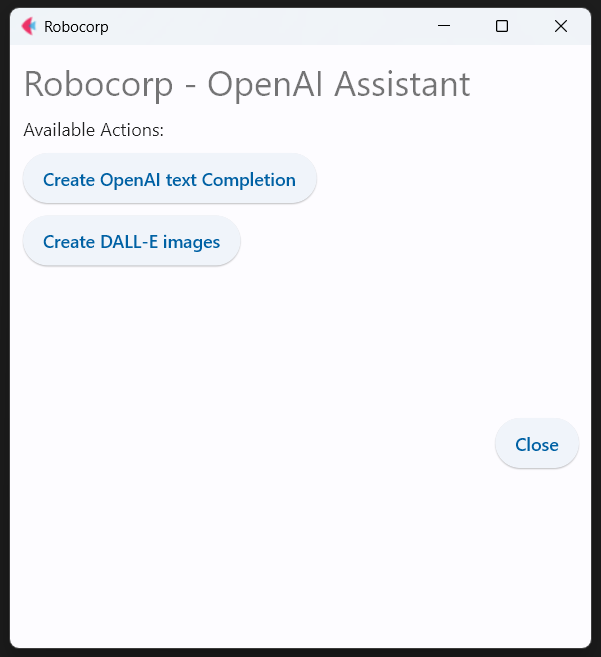

# Robocorp RPA.Assistant with OpenAI demo

This robot uses RPA.Assistant library and provides a way to display information to a user and request input while a robot is running. Robot also uses the RPA.OpenAI library.

> The robot provides user a way to create text completions and images with OpenAI. OpenAI account and API key is required to use OpenAI API. 

## The robot code

```robot
*** Settings ***
Documentation       Assistant bot that uses RPA.OpenAI library. 
Library             OperatingSystem
Library             RPA.Assistant
Library             RPA.OpenAI
Library             RPA.Robocorp.Vault
Library             RPA.Desktop
Library             RPA.HTTP

*** Variables ***
${counter}    1

*** Tasks ***
Main
    [Documentation]
    ...    The Main task running the Assistant
    ...    Configure your window behaviour here   
    Get Secrets and Authorize to OpenAI
    Display Main Menu
    ${result}=    RPA.Assistant.Run Dialog
    ...    title=Robocorp
    ...    on_top=True
    ...    height=520

*** Keywords ***
Get Secrets and Authorize to OpenAI
    ${secrets}   Get Secret   OpenAI
    Authorize To Openai    ${secrets}[key]

Display Main Menu
    Clear Dialog
    Add Heading    Robocorp - OpenAI Assistant
    Add Text    Available Actions:
    Add Button    Create OpenAI text Completion    Text Completion Window
    Add Button    Create DALL-E images    Image Create Window
    Add image   url_or_path=volvo.png   width=102  height=102
    Add Submit Buttons    buttons=Close    default=Close

Back To Main Menu
    [Arguments]   ${result}
    Display Main Menu
    Refresh Dialog

Text Completion Window
    Clear Dialog
    Add Heading    Create text Completion   size=Small
    Add Text Input    prompt_input    Input prompt 
    Add Next Ui Button    Create     Create a Completion   
    Add Next Ui Button    Back    Back To Main Menu
    Refresh Dialog

Image Create Window
    Clear Dialog
    Add Heading    Create images with DALL-E   size=Small
    Add Text Input    image_input    Input prompt 
    Add Drop-down
    ...    name=num
    ...    options=1,2,3
    ...    default=1
    ...    label=Number of images
    Add Drop-down
    ...    name=size
    ...    options=256x256,512x512,1024x1024
    ...    default=512x512
    ...    label=Image Size      
    Add checkbox    name=download     label=Download images    default=False
    Add Next Ui Button    Create     Create a Image   
    Add Next Ui Button    Back    Back To Main Menu
    Refresh Dialog

Create a Completion
    [Arguments]   ${form}
    ${completion_from_openai}   Completion Create    ${form}[prompt_input]
    Clear Dialog
    Add Heading    Text Completion
    Add text    ${completion_from_openai}
    Add Button    Copy response to clipboard    Set clipboard value   ${completion_from_openai}
    Add Next Ui Button    Back    Back To Main Menu
    Refresh Dialog

Create a Image
    [Arguments]   ${form}
    ${image_urls}    Image Create     prompt=${form}[image_input]   size=${form}[size]   num_images=${form}[num]
    Clear Dialog
    Add Heading    DALL-E Image   size=Small
    FOR    ${url}    IN    @{image_urls}
        Add link    ${url}   Image ${counter}   
        ${counter}   Evaluate    ${counter}+1
        IF    '${form}[download]' == 'true'
            Download   ${url}    
        END
    END
    Add Next Ui Button    Back    Back To Main Menu
    Refresh Dialog
```



## Learning materials

- [Robocorp Developer Training Courses](https://robocorp.com/docs/courses)
- [Documentation links on Robot Framework](https://robocorp.com/docs/languages-and-frameworks/robot-framework)
- [Example bots in Robocorp Portal](https://robocorp.com/portal)
